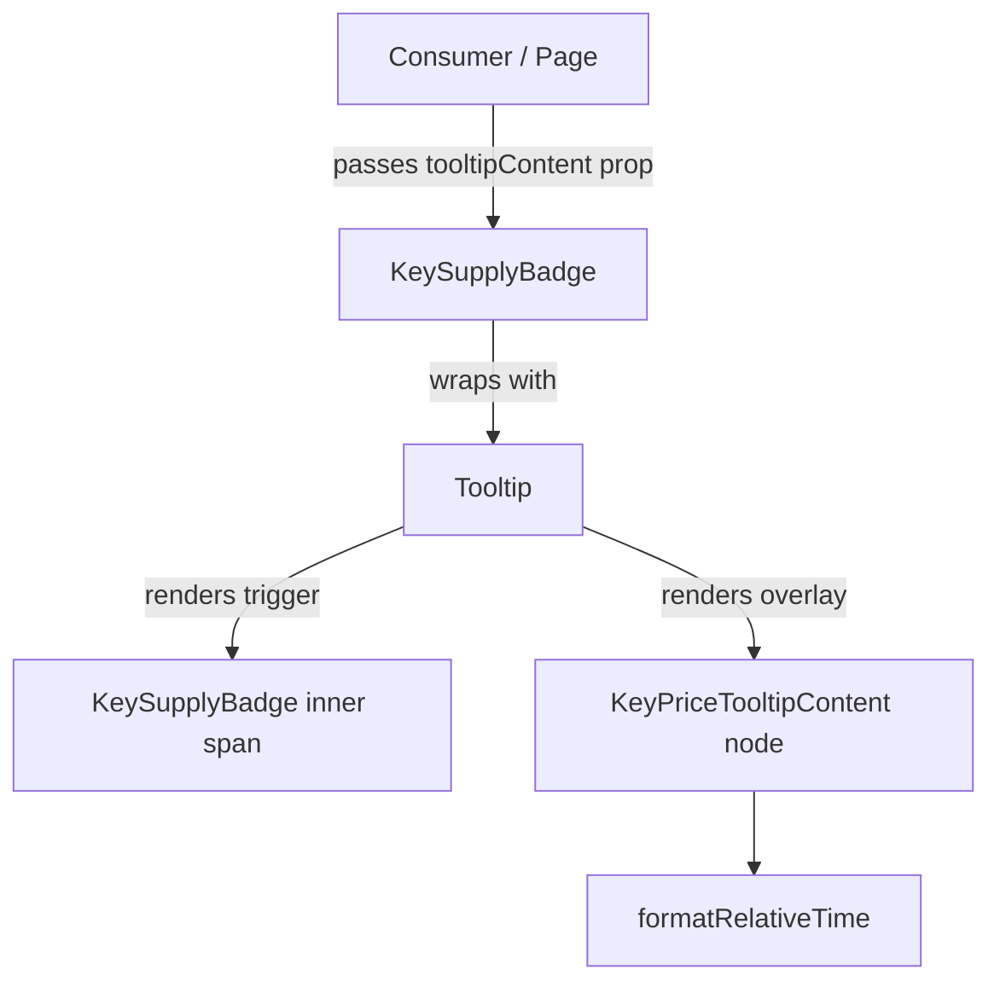

# Design Document

## Overview

This feature enhances `KeySupplyBadge` by wrapping it in a rich tooltip that surfaces key price metadata — specifically the last-updated timestamp and the quote source. The implementation extends the existing `Tooltip` component to accept `React.ReactNode` content (backward-compatible), adds a `KeyPriceTooltipContent` data type, and composes a `KeyPriceTooltip` wrapper that formats and renders the metadata.

No visual changes are made to `KeySupplyBadge` itself. The tooltip is triggered by hover, keyboard focus, and mobile tap, and is fully accessible via `role="tooltip"` and `aria-describedby`.

## Architecture

The change is purely at the component layer — no new services, stores, or API calls are introduced.



Key design decisions:

- The `Tooltip` component is extended in-place (widening `content` to `React.ReactNode`) rather than creating a parallel component, keeping the API surface small and all existing usages unaffected.
- Relative-time formatting is a pure utility function, making it trivially testable without mounting any component.
- `KeySupplyBadge` gains an optional `tooltipContent` prop; when absent the badge renders exactly as before.

## Components and Interfaces

### `Tooltip` (extended)

File: `src/components/ui/tooltip.tsx`

```ts
interface TooltipProps {
	content: React.ReactNode; // widened from string — backward-compatible
	children: React.ReactNode;
}
```

The overlay `<div>` gains:

- a stable `id` (generated once via `useId`) so consumers can reference it with `aria-describedby`
- `whitespace-normal` replaces `whitespace-nowrap` to support multi-line content
- visibility is tracked in state so `aria-describedby` can be conditionally applied

### `KeyPriceTooltipContent` (new React node helper)

File: `src/components/common/KeySupplyBadge.tsx` (co-located, unexported)

Renders the two-line tooltip body from a `TooltipContent` object.

### `KeySupplyBadge` (extended)

```ts
interface TooltipContent {
	lastUpdated?: string | null; // ISO 8601 timestamp
	quoteSource?: string | null;
}

interface KeySupplyBadgeProps {
	supply?: number | null;
	className?: string;
	tooltipContent?: TooltipContent; // new optional prop
}
```

When `tooltipContent` is provided the badge is wrapped in `<Tooltip>`; otherwise it renders unchanged.

## Data Models

### `TooltipContent`

| Field         | Type             | Required | Description                              |
| ------------- | ---------------- | -------- | ---------------------------------------- |
| `lastUpdated` | `string \| null` | No       | ISO 8601 timestamp of last price refresh |
| `quoteSource` | `string \| null` | No       | Name of the data provider / exchange     |

### `formatRelativeTime(iso: string | null | undefined): string`

Pure function. Returns a human-readable relative string ("Updated 3 min ago") or `"Last updated: N/A"` when the input is absent or unparseable.

| Input                                | Output                |
| ------------------------------------ | --------------------- |
| `"2024-01-15T10:30:00Z"` (3 min ago) | `"Updated 3 min ago"` |
| `null` / `undefined`                 | `"Last updated: N/A"` |
| Invalid date string                  | `"Last updated: N/A"` |

Relative buckets: seconds → "just now", minutes, hours, days.

## Correctness Properties

_A property is a characteristic or behavior that should hold true across all valid executions of a system — essentially, a formal statement about what the system should do. Properties serve as the bridge between human-readable specifications and machine-verifiable correctness guarantees._

### Property 1: Tooltip visibility follows activation state

_For any_ `Tooltip` instance, the overlay should be visible after a hover or focus activation event fires on the wrapper, and hidden after the corresponding leave or blur event fires.

**Validates: Requirements 1.1, 1.2, 1.4**

---

### Property 2: Tooltip toggles on tap

_For any_ `Tooltip` instance, a tap/click event on the wrapper should toggle the overlay from hidden to visible (and from visible to hidden on a second tap).

**Validates: Requirements 1.3**

---

### Property 3: Relative time formatting

_For any_ valid ISO 8601 timestamp string, `formatRelativeTime` should return a non-empty string matching the pattern `"Updated <N> <unit> ago"` or `"just now"`. For any null, undefined, or unparseable input, it should return exactly `"Last updated: N/A"`.

**Validates: Requirements 2.1, 2.2**

---

### Property 4: Source label rendering

_For any_ non-empty `quoteSource` string, the rendered tooltip body should contain the text `"Source: <quoteSource>"`. For any null, undefined, or empty string, it should contain exactly `"Source: N/A"`.

**Validates: Requirements 3.1, 3.2**

---

### Property 5: Fully missing data renders all N/A fallbacks

_Example:_ When `TooltipContent` is `{}` (all fields absent), the rendered tooltip body should contain both `"Last updated: N/A"` and `"Source: N/A"`.

**Validates: Requirements 4.1**

---

### Property 6: Badge is unchanged without tooltipContent

_Example:_ Rendering `<KeySupplyBadge supply={42} />` (no `tooltipContent`) should produce output identical to the pre-feature baseline — no wrapper element, no tooltip overlay, same class names.

**Validates: Requirements 4.2, 6.3**

---

### Property 7: Tooltip overlay always carries role="tooltip"

_For any_ content value (string or ReactNode) passed to `Tooltip`, the rendered overlay element should have `role="tooltip"`.

**Validates: Requirements 5.1**

---

### Property 8: aria-describedby tracks tooltip visibility

_For any_ `Tooltip` instance, when the overlay is visible the trigger wrapper should have an `aria-describedby` attribute whose value matches the overlay's `id`; when the overlay is hidden the attribute should be absent or empty.

**Validates: Requirements 5.2, 5.3**

---

### Property 9: Tooltip overlay carries expected CSS classes

_For any_ content value passed to `Tooltip`, the rendered overlay element should include the classes for dark background (`bg-black`), rounded corners (`rounded-md`), and shadow (`shadow-md`).

**Validates: Requirements 6.1**

---

### Property 10: ReactNode content renders unchanged

_For any_ value passed as `content` to `Tooltip` (string or ReactNode), the rendered overlay should contain that value without modification or wrapping that alters its text content.

**Validates: Requirements 7.1, 7.2**

---

## Error Handling

| Scenario                                | Behavior                                               |
| --------------------------------------- | ------------------------------------------------------ |
| `lastUpdated` is an invalid date string | `formatRelativeTime` returns `"Last updated: N/A"`     |
| `lastUpdated` is a future timestamp     | Returns `"just now"` or a sensible fallback — no crash |
| `quoteSource` is an empty string        | Treated as absent; renders `"Source: N/A"`             |
| `tooltipContent` prop omitted entirely  | Badge renders without any tooltip wrapper              |
| `content` prop is `null` or `undefined` | Tooltip renders an empty overlay — no crash            |

All error paths are handled at the formatting/rendering layer; no exceptions are thrown to consumers.

## Testing Strategy

### Dual Testing Approach

Both unit tests and property-based tests are required and complementary.

- Unit tests cover specific examples, integration points, and edge cases.
- Property tests verify universal invariants across many generated inputs.

### Property-Based Testing

Library: **fast-check** (TypeScript-native, works with Vitest/Jest).

Each property test runs a minimum of **100 iterations**.

Every test is tagged with a comment in the format:
`// Feature: key-price-tooltip, Property <N>: <property_text>`

| Property | Test description                                  | Generator inputs                         |
| -------- | ------------------------------------------------- | ---------------------------------------- |
| P1       | Tooltip shows on hover/focus, hides on leave/blur | Any ReactNode content                    |
| P2       | Tooltip toggles on tap                            | Any ReactNode content                    |
| P3       | `formatRelativeTime` output format                | Random valid ISO strings; null/undefined |
| P4       | Source label rendering                            | Random non-empty strings; null/empty     |
| P7       | `role="tooltip"` always present                   | Random string content                    |
| P8       | `aria-describedby` tracks visibility              | Random string content                    |
| P9       | CSS classes always present                        | Random string content                    |
| P10      | ReactNode content renders unchanged               | Random strings and React elements        |

### Unit Tests

- P5: Render `<KeyPriceTooltipContent tooltipContent={{}} />` → assert both N/A strings present.
- P6: Render `<KeySupplyBadge supply={42} />` → assert no tooltip wrapper in output.
- `formatRelativeTime` edge cases: future date, exactly 0 seconds ago, 59 seconds, 60 seconds, 59 minutes, 60 minutes, 23 hours, 24 hours.
- Backward compatibility: existing `<Tooltip content="hello">` usage renders the string correctly.
